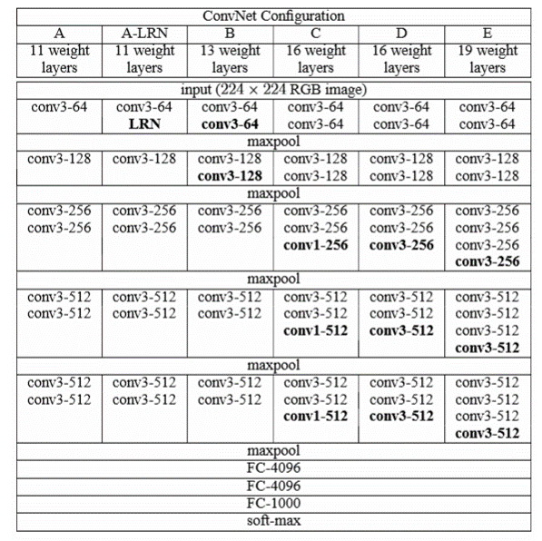
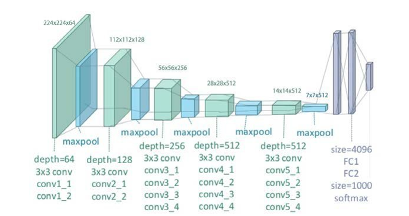
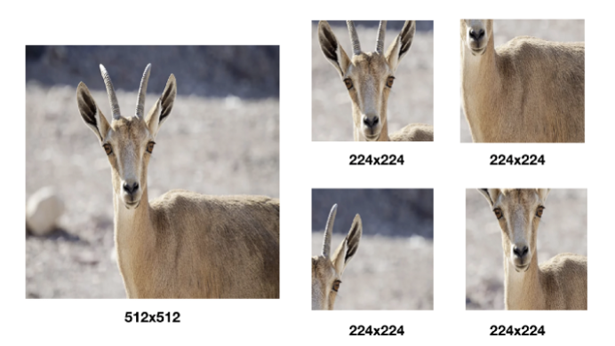

# VGG implementation

딥러닝 공부있는데 implement 부분에 있어 약하다고 생각해서
pytorch로 모델링 공부를 해보겠습니다.

model configuration 

depth에 따라 model를 구분 지었습니다.

저는 19개의 layer를 쌓은 vgg19 모델을 구현해 보겠습니다.

model의 figure는 아래와 같습니다.
model Aritecture  

### Chek list 
- input image size -> crop 된 224x224 RGB imgae
- activation func  ->
- nomalization
- pooling
- batch size
- optimizer
- weight decay     ->
- loss function    -> Cross Entropy

input image로는 224x224 size의 RGB imgae를 사용합니다.
기존의 image를 crop를 해서 사용합니다.

