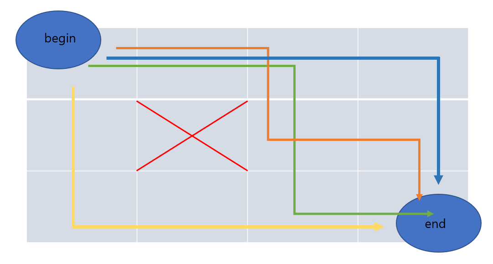

## [프로그래머스/Lv3] 등굣길_C++
---

### 문제 내용 <br>
- 초등학교 때 배운 최단경로 문제와 동일하다.<br>
- 출발지점 부터 도착지점까지 웅덩이를 피해 가는 최단경로를 구하는 문제이다.<br>

<br>

### 입출력 예 <br>

|Row|Col|웅덩이|return|
|---|---|---|---|
|4|3|[[2,2]]|4|

<br>


<br>

### 문제 풀이 <br>
- 가독성을 위해 주석으로도 설명하겠다.<br>
- 최대 크기의 배열을 설정한 뒤, 각 요소에 그 지점 까지 오는데 얻을 수 있는 경우의 수를 저장한다. <br>
- 오른쪽 or 하단 으로만 이동하므로 왼쪽 과 상단을 경우의 수를 1로 지정하여 배열을 초기화 한다.<br>
  - 0 1 0 0 0 
  - 0 1 1 1 1
  - 0 1 0 0 0
  - 0 1 0 0 0
  - 0 1 0 0 0 <br>
  맨위 행에 1이 있는 이유는 자신의 value를 왼쪽,위 의 합의 값으로 정하기 때문에 처음에 초기화 할 때 사용하기 위함이다.<br>
- 물 웅덩이가 있는 부분은 -1로 초기화 해주고, 웅덩이 부분은 경우의수로 판단하지 않게 하기 위해서 value를 넣을 때에는 0으로 다시 정의해 주었다.
  
<br>
<br>


### 풀이 CODE <br>
```c++
#include <string>
#include <vector>
#include <iostream>

using namespace std;

int root[101][101] ={0};


int solution(int m, int n, vector<vector<int>> puddles) {
                                                        //    0  1  0  0  0      -> 1이 필요.
    for(int y=0; y<=m;y++){ root[y][1] =1; }            //    0  1  1  1  1      처음에 갈 수 있는 갯수로 초기화
    for(int x=1; x<=n;x++){ root[1][x] =1; }            //    0  1  -1 0  0
    for(int i=0; i<puddles.size();i++){                 //    0  1  0  -1 0
        int dump_y =puddles[i][0];                      //    0  1  0  0  0
        int dump_x =puddles[i][1];
        root[dump_y][dump_x] = -1;
    }
    

    for(int y=1; y<=m; y++){          
        for(int x=1; x<=n; x++){               
            int temp = root[y][x];           // 웅덩이라면 0으로 그렇지 않다면 왼쪽,위쪽의 합으로
            root[y][x] = temp == -1 ? 0 : (root[y-1][x] + root[y][x-1]) % 1000000007 ;     
        }
    }
    
   
    return root[m][n];

}
```